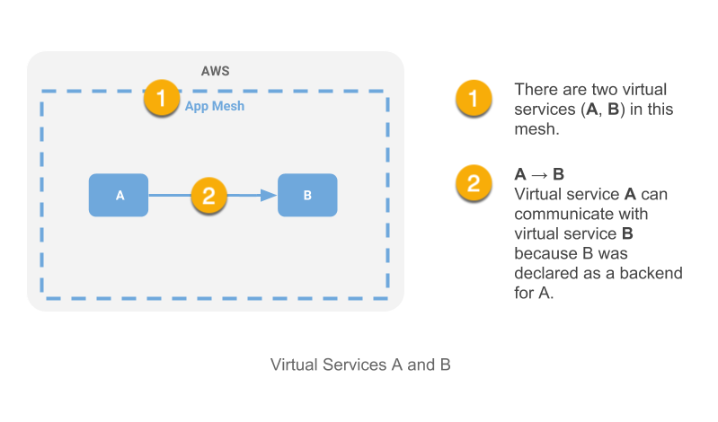

# AWS App Mesh Deep Dive with the Color App

If you had the opportunity to watch the AWS App Mesh launch on March 27, then you saw Nick Coult, the launch Product Manager, give a nice demo using a simple application called the Color App. In this blog post, I'm going dig a bit deeper into App Mesh than the time for the launch demo permitted. After that, I'll walk you through setting up the Color App demo and running it on your own so you can experiment and familiarize yourself with App Mesh on your own.

Here's what we're going to do:

1. Define terms and concepts for this post.
1. Deploy a VPC for the application.
2. Deploy a service mesh for the application with App Mesh.
3. Deploy compute infrastructure for the application.
4. Deploy services to compute infrastructure that will be managed and monitored using App Mesh.
5. Use App Mesh to shape traffic for our application and observe the results with
[Amazon CloudWatch] and [AWS X-Ray].

## Terminology and Concepts

[Amazon Virtual Private Cloud] (VPC) is a virtual network that provides isolation from other applications in other networks running on AWS.

[AWS CloudFormation] provides a common language for you to describe and provision all the
infrastructure resources in your cloud environment.

[AWS App Mesh] is a service mesh that provides application-level networking support, standardizing how you control and monitor your services across multiple types of compute infrastructure. A service mesh is a logical boundary for network traffic between the services that reside in it. App Mesh consists of the following core resources: 

* Virtual services
* Virtual nodes
* Virtual routers
* Routes

The term *virtual* is used because the resources it applies to are abstractions for the App Mesh model.

[Envoy] is a proxy that you deploy with each microservice after creating your mesh resources (virtual services, virtual nodes, virtual routers, and routes). You will normally run it in a container using the [Envoy Image], which you configure to as part of your task or pod definition for your microservice. Envoy proxies provide the foundation for the App Mesh implementation of its core resource abstractions. Service-to-service communication in the data plane flows through Envoy proxies that intercept all ingress and egress traffic for each microservice they are associated with through the mesh configuration.

### Virtual Services

A **virtual service** is an abstraction for a real microservice. When configuring App Mesh, you might define a virtual service called `B`; another virtual service in the mesh (such as `A`) that declares `B` as a backend can then communicate with it using this name regardless of whether the underlying physical service is running in the same compute cluster (e.g., ECS) or not.



By using the virtual service name, service A need not be aware of the specific version of a service its communication is being directed to. This feature makes it easy for the App Mesh operator to shape traffic in ways that support various scenarios, such as [Blue-Green deployments], [A/B testing], and [Canary releases].

### Virtual Nodes

### Virtual Routers

### Routes


## Prerequisites

1. You have the latest version of the [AWS CLI] installed.

2. Your [AWS CLI configuration] has a `default` or named profile and valid credentials.

3. You have cloned the [github.com/aws/app-mesh-examples] repo and changed directory to the project root.

## Create the VPC

We'll use a script to deploy a [CloudFormation] stack that will create a VPC
for our application.

The VPC will be created for the region specified by the `AWS_DEFAULT_REGION` environment variable. It will be configured for two availability zones (AZs); each AZ will be configured with a public and a private subnet. App Mesh is currently available in nineteen [AWS regions]:

The deployment will include an [Internet Gateway] and a pair of [NAT Gateways] (one in each AZ) with default routes for them in the private subnets.

The following environment variables need to be set before running the script:

* `AWS_PROFILE` should be set to a profile that you've configured for the AWS CLI (either `default` or a named profile).
* `AWS_DEFAULT_REGION` should be set to a region from the supported regions shown previously.
* `ENVIRONMENT_NAME` will be used as a prefix for the CloudFormation stacks that you will deploy.

To deploy the stack, run `examples/infrastructure/vpc.sh`:

```
$ export AWS_PROFILE=default
$ export AWS_DEFAULT_REGION=us-west-2
$ export ENVIRONMENT_NAME=DEMO
$ .examples/infrastructure/vpc.sh
...
+ aws --profile default --region us-west-2 cloudformation deploy --stack-name DEMO-vpc --capabilities CAPABILITY_IAM --template-file examples/infrastructure/vpc.yaml --parameter-overrides EnvironmentName=DEMO 
Waiting for changeset to be created..
Waiting for stack create/update to complete
...
Successfully created/updated stack - DEMO-vpc
```

## Create an App Mesh

The following CloudFormation template will be used to create our mesh:

`examples/infrastructure/appmesh-mesh.yaml`

```
Parameters:

  EnvironmentName:
    Description: An environment name that will be prefixed to resource names
    Type: String

  AppMeshMeshName:
    Type: String
    Description: Name of mesh

Resources:

  Mesh:
    Type: AWS::AppMesh::Mesh
    Properties:
      MeshName: !Ref AppMeshMeshName

Outputs:

  Mesh:
    Description: A reference to the AppMesh Mesh
    Value: !Ref Mesh
    Export:
      Name: !Sub "${EnvironmentName}:Mesh"
```

We will use the same environment variables from the previous step, plus one additional one (`MESH_NAME`), to deploy the stack using a script (`appmesh-mesh.sh`).

* `MESH_NAME` should be set to the name you want to use to identify the mesh. For this demo, we will call it `appmesh-mesh`.

```
$ ./examples/infrastructure/appmesh-mesh.sh
...
+ aws --profile default --region us-west-2 cloudformation deploy --stack-name DEMO-appmesh-mesh --capabilities CAPABILITY_IAM --template-file /home/ec2-user/projects/aws/aws-app-mesh-examples/examples/infrastructure/appmesh-mesh.yaml --parameter-overrides EnvironmentName=DEMO AppMeshMeshName=appmesh-mesh

Waiting for changeset to be created..
Waiting for stack create/update to complete
...
Successfully created/updated stack - DEMO-appmesh-mesh
```


[A/B testing]: https://en.wikipedia.org/wiki/A/B_testing
[AWS CloudFormation]: https://aws.amazon.com/cloudformation/
[Amazon CloudWatch]: https://aws.amazon.com/cloudwatch/
[Amazon Virtual Private Cloud]: https://docs.aws.amazon.com/vpc/latest/userguide/what-is-amazon-vpc.html
[AWS App Mesh]: https://aws.amazon.com/app-mesh/
[AWS CLI]: https://docs.aws.amazon.com/cli/latest/userguide/cli-chap-install.html
[AWS CLI configuration]: https://docs.aws.amazon.com/cli/latest/userguide/cli-chap-configure.html
[AWS regions]: ./regions.md
[AWS X-Ray]: https://aws.amazon.com/xray/
[Blue-Green deployments]: https://martinfowler.com/bliki/BlueGreenDeployment.html
[Canary releases]: https://martinfowler.com/bliki/CanaryRelease.html
[Envoy]: https://www.envoyproxy.io/ 
[Envoy Image]: https://docs.aws.amazon.com/app-mesh/latest/userguide/envoy.html
[github.com/aws/app-mesh-examples]: https://github.com/aws/aws-app-mesh-examples
[Internet Gateway]: https://docs.aws.amazon.com/vpc/latest/userguide/VPC_Internet_Gateway.html
[NAT Gateway]: https://docs.aws.amazon.com/vpc/latest/userguide/vpc-nat-gateway.html
