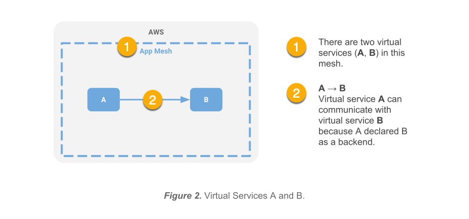
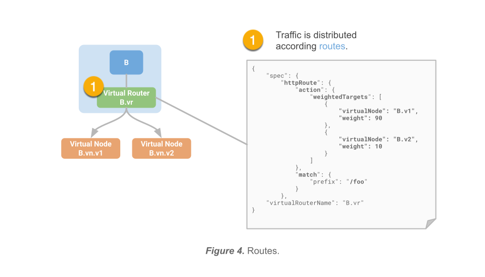
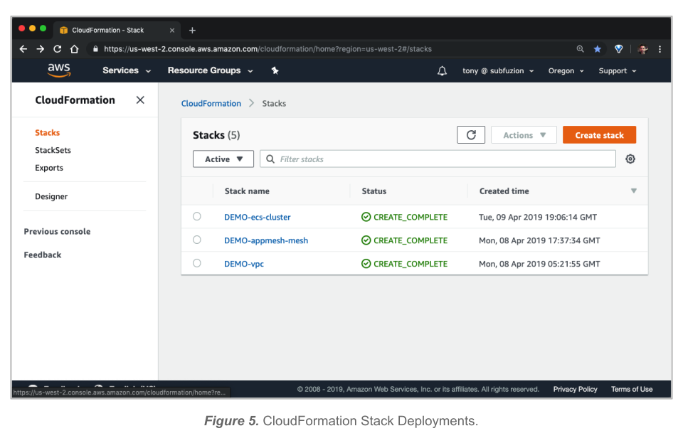
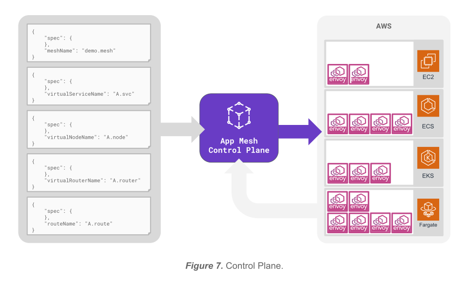

# AWS App Mesh Deep Dive with the Color App

If you had the opportunity to watch the AWS App Mesh General Availability (GA) launch on March 27, 2019, then you saw Nick Coult, the launch Product Manager, give a nice demo using a simple application called the [Color App].


In this article, I'm going dig a bit deeper into App Mesh than the time for the launch demo permitted. After that, I'll walk you through setting up and running the Color App demo so you can get familiar with App Mesh and experiment on your own.

If you just want to launch the Color App right away, you can follow this [Color App Walkthrough].

Here's what this post will cover:

- [AWS App Mesh Deep Dive with the Color App](#aws-app-mesh-deep-dive-with-the-color-app)
  - [Terminology and Concepts](#terminology-and-concepts)
    - [Virtual Services, Virtual Nodes, and Virtual Routers](#virtual-services-virtual-nodes-and-virtual-routers)
    - [Routes](#routes)
    - [Service Discovery](#service-discovery)
  - [Provision infrastructure for the application](#provision-infrastructure-for-the-application)
    - [Prerequisites](#prerequisites)
    - [Create the VPC](#create-the-vpc)
    - [Create an App Mesh](#create-an-app-mesh)
    - [Create compute resources](#create-compute-resources)
    - [Review](#review)
  - [Deploy the application](#deploy-the-application)
    - [Overview](#overview)
    - [Digging deeper](#digging-deeper)
    - [Configure App Mesh resources](#configure-app-mesh-resources)
    - [Deploy services to ECS](#deploy-services-to-ecs)
  - [Shape traffic](#shape-traffic)
    - [Apply traffic rules](#apply-traffic-rules)
    - [Monitor with Amazon CloudWatch and AWS X-Ray](#monitor-with-amazon-cloudwatch-and-aws-x-ray)
  - [Summary](#summary)
  - [Resources](#resources)


## Terminology and Concepts

[Amazon Virtual Private Cloud] (VPC) is a virtual network that provides isolation from other applications in other networks running on AWS.

[AWS CloudFormation] provides a common language for you to describe and provision all the
infrastructure resources in your cloud environment.

A service mesh a logical boundary for network traffic between services that reside in it. [AWS App Mesh] is a managed service mesh control plane. It provides application-level networking support, standardizing how you control and monitor your services across multiple types of compute infrastructure. The App Mesh model consists of the following core resources: 

* **Meshes**
* **Virtual services**
* **Virtual nodes**
* **Virtual routers**
* **Routes**

The term *virtual* is used for abstract resources that directly map to an actual, physical resource.

[Envoy] is a proxy that you deploy with each microservice after creating your mesh resources (virtual services, virtual nodes, virtual routers, and routes). You will normally run it in a container using the AWS App Mesh provided [Envoy Image], which you configure to as part of your task or pod definition for your microservice. Envoy proxies provide the foundation for the App Mesh implementation of its core resource abstractions. Service-to-service communication in the data plane flows through Envoy proxies that intercept all ingress and egress traffic for each microservice they are associated with through the mesh configuration.

### Virtual Services, Virtual Nodes, and Virtual Routers

A **virtual service** is an abstraction for a real microservice. When configuring App Mesh, you might define a virtual service named `B`; another virtual service in the mesh (such as `A`) communicates with `B` using this name regardless of how and where `B` ultimately maps to underlying compute resources running on AWS.



By using the virtual service name, service A need not be aware of the specific version of service B to communicate with. This feature makes it easy for the App Mesh operator to shape traffic transparently to service consumers in ways that support various scenarios, such as [Blue-Green deployments], [A/B testing], and [Canary releases].

Although virtual services interact with each other using their virtual service names, a virtual service ultimately needs to resolve a specific compute resource. When creating a virtual service you will specify a provider; this can be either a **virtual node** that acts as a logical pointer to a particular compute resource (which itself might be a logical compute abstraction, such as a task group for an ECS service or a Kubernetes deployment) or to a **virtual router** that will spread traffic across a *set* of virtual nodes.


> Important! These virtual services are abstractions to help us configure our mesh. Ultimately, App Mesh transforms this abstract configuration into concrete Envoy-specific configuration specifications. These are then pushed by the App Mesh control plane to each Envoy proxy coupled (generally as a sidecar) to a microservice in the mesh. Communication between concrete service instances flows through these proxies directly (point-to-point) within the data plane. There is no performance penalty for using these abstractions to drive optimal configuration.

### Routes

As mentioned in the previous section, virtual routers provide a layer of indirection between virtual services and virtual nodes to distribute traffic among them. How traffic gets spread across these virtual nodes is determined by **routes**. Routes are rules associated with a virtual router used to match incoming requests and apply an action that governs which virtual node the request will actually be sent to.



### Service Discovery

## Provision infrastructure for the application

### Prerequisites

1. You have the latest version of the [AWS CLI] installed.

2. Your [AWS CLI configuration] has a `default` or named profile and valid credentials.

3. You have cloned the [github.com/aws/app-mesh-examples] repo and changed directory to the project root.

### Create the VPC

We'll use a script to deploy a [AWS CloudFormation] stack that will create a VPC
for our application.

The VPC will be created for the region specified by the `AWS_DEFAULT_REGION` environment variable. It will be configured for two availability zones (AZs); each AZ will be configured with a public and a private subnet. You can choose to from one of the nineteen [Currently available AWS regions for App Mesh]:

The deployment will include an [Internet Gateway] and a pair of [NAT Gateways] (one in each AZ) with default routes for them in the private subnets.

The following environment variables need to be set before running the script:

* `AWS_PROFILE` should be set to a profile that you've configured for the AWS CLI (either `default` or a named profile).
* `AWS_DEFAULT_REGION` should be set to a region from the supported regions shown previously.
* `ENVIRONMENT_NAME` will be used as a prefix for the CloudFormation stacks that you will deploy.

***To deploy the stack and create the VPC, run the following script:***

`examples/infrastructure/vpc.sh`

```
$ export AWS_PROFILE=default
$ export AWS_DEFAULT_REGION=us-west-2
$ export ENVIRONMENT_NAME=DEMO
$ ./examples/infrastructure/vpc.sh
...
+ aws --profile default --region us-west-2 cloudformation deploy --stack-name DEMO-vpc --capabilities CAPABILITY_IAM --template-file examples/infrastructure/vpc.yaml --parameter-overrides EnvironmentName=DEMO 
Waiting for changeset to be created..
Waiting for stack create/update to complete
...
Successfully created/updated stack - DEMO-vpc
$
```

### Create an App Mesh

The following CloudFormation template will be used to create our mesh:

`examples/infrastructure/appmesh-mesh.yaml`

```
Parameters:

  EnvironmentName:
    Description: An environment name that will be prefixed to resource names
    Type: String

  AppMeshMeshName:
    Type: String
    Description: Name of mesh

Resources:

  Mesh:
    Type: AWS::AppMesh::Mesh
    Properties:
      MeshName: !Ref AppMeshMeshName

Outputs:

  Mesh:
    Description: A reference to the AppMesh Mesh
    Value: !Ref Mesh
    Export:
      Name: !Sub "${EnvironmentName}:Mesh"
```

We will use the same environment variables from the previous step, plus one additional one (`MESH_NAME`), to deploy the stack using a script (`appmesh-mesh.sh`).

* `MESH_NAME` should be set to the name you want to use to identify the mesh. For this demo, we will call it `appmesh-mesh`.

***To deploy the stack and create the mesh, run the following script:***

`examples/infrastructure/appmesh-mesh.sh`
```
$ ./examples/infrastructure/appmesh-mesh.sh
...
+ aws --profile default --region us-west-2 cloudformation deploy --stack-name DEMO-appmesh-mesh --capabilities CAPABILITY_IAM --template-file /home/ec2-user/projects/aws/aws-app-mesh-examples/examples/infrastructure/appmesh-mesh.yaml --parameter-overrides EnvironmentName=DEMO AppMeshMeshName=appmesh-mesh

Waiting for changeset to be created..
Waiting for stack create/update to complete
...
Successfully created/updated stack - DEMO-appmesh-mesh
$
```

At this point we have now created our networking resources (VPC and App Mesh), but we have not yet deployed:

* compute resources to run our services on
* mesh configuration for our services
* actual services

### Create compute resources

Our infrastructure requires compute resources to run our services on. We'll use another script to deploy an [AWS CloudFormation] stack that will create an initial ECS cluster for our demo. Both the script and the template are located under `examples/infrastructure` (you can also choose to create an EKS cluster, if you prefer).

In addition to the previous defined environment variables, you will also need to export the following:

* `SERVICES_DOMAIN` - this is the domain under which services in the mesh will be discovered. For this demo, we will use `demo.local`. In this demo, the colorgateway virtual service will send requests to the colorteller virtual service at `colorteller.demo.local`.
* `KEY_PAIR_NAME` - this is your EC2 keypair that you can use to ssh into your EC2 instances, allowing you to test your routing without configuring a public ALB to the application frontend.
 
You can also override the demo script's default cluster size (5) by setting `CLUSTER_SIZE`:

* `CLUSTER_SIZE` - the number of EC2 instances to provision for the ECS cluster (the demo script will default to 5).

This example uses a script (`ecs-cluster.sh`) to deploy an ECS cluster, but you can use `eks-cluster.sh` to deploy an EKS cluster if you prefer.

***To deploy the stack and create the ECS cluster, run the following script:***

`examples/infrastructure/ecs-cluster.sh`

```
$ ./examples/infrastructure/ecs-cluster.sh
...
+ aws --profile default --region us-west-2 cloudformation deploy --stack-name DEMO-ecs-cluster --capabilities CAPABILITY_IAM --template-file /home/ec2-user/projects/aws/aws-app-mesh-examples/examples/infrastructure/ecs-cluster.yaml --parameter-overrides EnvironmentName=DEMO KeyName=tony_devbox2 ECSServicesDomain=demo.local ClusterSize=5

Waiting for changeset to be created..
Waiting for stack create/update to complete
...
Successfully created/updated stack - DEMO-ecs-cluster
$
```

### Review

You have provisioned the infrastructure you need. You can confirm in the AWS Console that all of your CloudFormation stacks have been successfully deployed. You should see something like this:



## Deploy the application

### Overview

The Color App consists of two microservices: **colorgateway** and **colorteller**.


The **colorteller** microservices responds to GET requests at the `/` (root) route by returning a color string (e.g., "blue").

The **colorgateway** microservice responds to GET requests at the `/color` route by returning a JSON object that contains:

* The color fetched from the **colorteller** service.
* A histogram of all colors fetched so far.

The response object might look like this the first time **colorgateway** responds:

```json
{
    "color": "blue",
    "stats": { "blue": 1.0 } 
}
```

### Digging deeper

While the Color App might seem a bit boring, it in fact is quite useful for demonstrating key concepts of App Mesh without a complex application obfuscating things.

We are going to launch different **colorteller** service versions that will return different colors. The **colorgateway** service will continue to make requests to **colorteller**, but depending on how we configure our route rules for **colorteller**, we will see varied responses over time.

Therefore, after a number of requests, the response from **colorgateway** might look like this:

```json
{
    "color": "blue",
    "stats": {
        "black": 0.16,
        "blue": 0.82,
        "red": 0
    }
}
```

If you read through the Concepts section previously, then you already have a basic understanding of how we're going to accomplish this. Let's examine in increasing detail.

The **colorgateway** and **colorteller** services will be *virtual services*. If you recall, we configured the service domain using the `SERVICES_DOMAIN` environment variable, which we set to `demo.local`. Therefore, the virtual service names for our services will be `colorgateway.demo.local` and `colorteller.demo.local`, respectively.

The **colorteller** service will be a backend for the **colorgateway** service, which means that **colorgateway** requests to `colorteller.demo.local` will have a route. This route will be pushed by the App Mesh control plane to the Envoy proxy sidecar for each actual running **colorgateway** service instance (e.g., ECS task or EKS pod).

Although it could, the source code for the **colorgateway** service doesn't hardcode the value for the **colorteller** endpoint; instead, the service is coded to read this value at runtime from an environment variable (`COLOR_TELLER_ENDPOINT`) when the service is deployed. This is because in a different deployment the service name used for discovery might change (e.g., coloradvisor.colorapp.svc.cluster.local) and because parts of the deployed endpoint, such as protocol and port, might change as well.

Be that as it may, however, once a virtual service name for a backend is configured with the mesh discovery service, App Mesh will ensure that routing information is propagated throughout the mesh to every Envoy proxy sidecar coupled to a service instance that sends traffic to that backend via its virtual service name.

We keep talking about traffic getting routed to the ultimate service instances. What does that mean? It means that somewhere there are compute resources that run the actual code to perform work. How this works depends on the compute environment the services are physically deployed to. For ECS, your microservice runs in a container as part of a (group of containers) deployed to EC2 instances; similarly, for EKS, this means Kubernetes pods; and so on.

Using ECS as a specific example, you might configure an ECS service to maintain a specific number of running tasks (instances of a task definition) spread across a cluster of EC2 instances to sustain your workload. Normally, to ensure that traffic to your tasks gets distributed evenly, you would configure Elastic Load Balancing using an Application Load Balancer for HTTP/S traffic or a Network Load Balancer for TCP traffic.

However, with App Mesh, you can skip the step of configuring Elastic Load Balancing for your tasks. Because each replicated task will launch with an Envoy sidecar, App Mesh flips the load balancing model on its head and pushes routing configuration to consuming tasks that will distribute traffic to backend tasks. This is why Envoy is used as the backbone for App Mesh; it was specifically designed to ingest configuration to handle precisely this type of job efficiently. Traffic no longer flows through an intermediary load balancer -- instead it is load-balanced (and shaped in other ways according to route rules) at the source task and flows directly to the appropriate destination task.

It is worth noting at this point that while we have been keeping things simple by discussing communication as if everything was running as tasks under ECS, App Mesh can in fact route traffic to different compute environments. Since the GA launch on March 27, 2019, your service communication under App Mesh can currently span ECS, EKS, EC2, and Fargate as supported compute environments, originating from one and terminating in another. App Mesh can even ensure that traffic is routed correctly for different versions of the target service running in different environments (e.g., v1 running on EC2 and v2 running on EKS)!

To simplify things from this point on, we will use the singular term *service task* to refer to any concrete type of running service instance, whether an individual service (containerized or not) on an EC2 instance, an ECS task, a Kubernetes pod, etc. We will use the plural term *service tasks* to refer to the set of task replicas resulting from scaling a task.

The App Mesh control plane is an engine that is fed information from two primary sources: you (the App Mesh operator), who provides abstract configuration representing your intent for how communication should flow in your application; and from Envoy proxies (in tandem with proxy bootstrap processes) deployed as task sidecars. Each time the control plane ingests an update it computes resultant Envoy-specific configurations to push out to each proxy.

These configurations aren't necessarily identical; the control plane only delivers the necessary configuration dedicated to each particular proxy for a service task governing its ingress and egress rules and routing information for communicating with upstream service tasks. So service task proxies for `A` that declared `B` as a backend will be delivered different configuration than service task proxies for `C` that declared `D` as a backend.



### Configure App Mesh resources

### Deploy services to ECS

## Shape traffic

### Apply traffic rules

### Monitor with Amazon CloudWatch and AWS X-Ray

## Summary

## Resources

[AWS App Mesh Documentation]

[AWS CLI]

[Color App]

[Currently available AWS regions for App Mesh]

[Envoy Image]

[Envoy documentation]


[A/B testing]: https://en.wikipedia.org/wiki/A/B_testing
[Amazon CloudWatch]: https://aws.amazon.com/cloudwatch/
[Amazon EC2 Key Pair]: https://docs.aws.amazon.com/AWSEC2/latest/UserGuide/ec2-key-pairs.html
[Amazon Virtual Private Cloud]: https://docs.aws.amazon.com/vpc/latest/userguide/what-is-amazon-vpc.html
[AWS App Mesh]: https://aws.amazon.com/app-mesh/
[AWS App Mesh Documentation]: https://aws.amazon.com/app-mesh/getting-started/
[AWS CLI]: https://docs.aws.amazon.com/cli/latest/userguide/cli-chap-install.html
[AWS CLI configuration]: https://docs.aws.amazon.com/cli/latest/userguide/cli-chap-configure.html
[AWS CloudFormation]: https://aws.amazon.com/cloudformation/
[AWS X-Ray]: https://aws.amazon.com/xray/
[Blue-Green deployments]: https://martinfowler.com/bliki/BlueGreenDeployment.html
[Canary releases]: https://martinfowler.com/bliki/CanaryRelease.html
[Color App]: https://github.com/aws/aws-app-mesh-examples/tree/master/examples/apps/colorapp
[Color App Walkthrough]: ./walkthrough.md
[Currently available AWS regions for App Mesh]: ./regions.md
[Elastic Load Balancing]: https://docs.aws.amazon.com/elasticloadbalancing/latest/userguide/what-is-load-balancing.html
[Envoy]: https://www.envoyproxy.io/ 
[Envoy documentation]: https://www.envoyproxy.io/docs/envoy/latest/
[Envoy Image]: https://docs.aws.amazon.com/app-mesh/latest/userguide/envoy.html
[github.com/aws/app-mesh-examples]: https://github.com/aws/aws-app-mesh-examples
[Internet Gateway]: https://docs.aws.amazon.com/vpc/latest/userguide/VPC_Internet_Gateway.html
[jq]: https://stedolan.github.io/jq/
[NAT Gateways]: https://docs.aws.amazon.com/vpc/latest/userguide/vpc-nat-gateway.html
