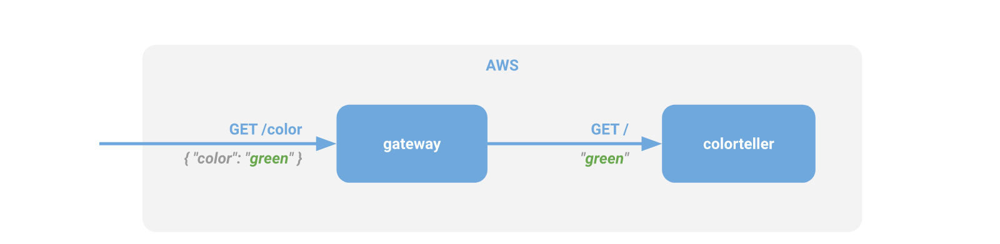
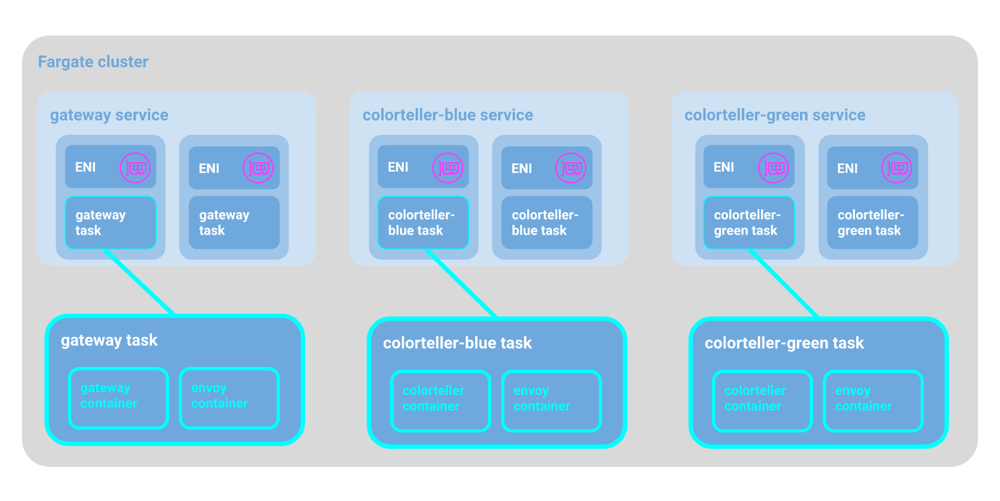
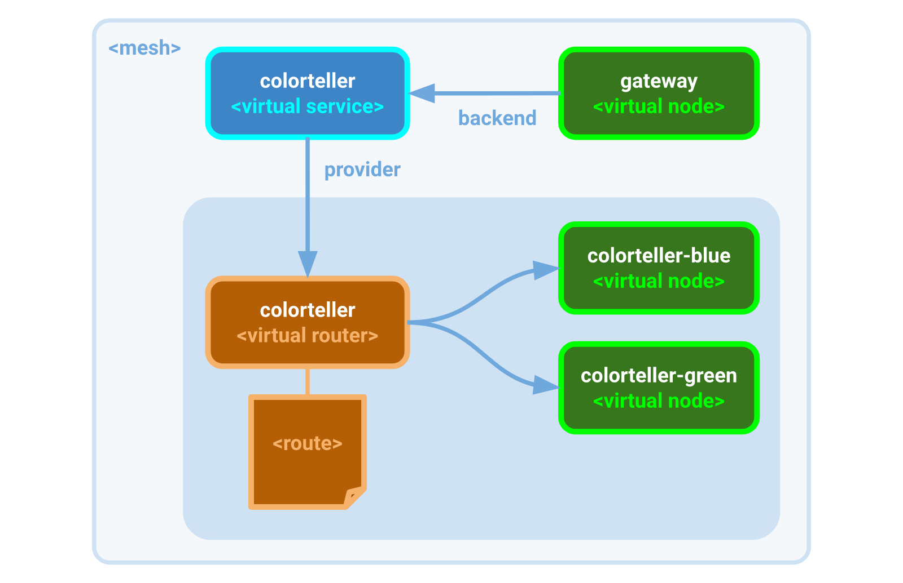

# Service Discovery with AWS Cloud Map for AWS App Mesh

Authors: Tony Pujals (Sr. Developer Advocate) and Scott Lavigne (Software Development Engineer)

This is Part 1 of a two part series that will explore using AWS Cloud Map for service discovery in App Mesh.

## Introduction

One of the things that App Mesh does to simplify management of your microservice applications and ensure they perform under dynamically changing conditions at scale is to integrate a very effective service discovery configuration facility. Up until now, it only supported DNS-based service discovery that was backed under the hood by AWS Cloud Map. This means that for all the compute services supported by App Mesh, you could leverage DNS names to access any registered application resource across your mesh and further benefit from the fact that Cloud Map constantly checks the health of these resources, ensuring locations are up-to-date. App Mesh would then deliver this updated information to the relevant consumers (specifically to Envoy proxies), ensuring that consumers always have current IP addresses for the resources they need to access.

For all of this, the configuration for service discovery is lightweight and simple — but now App Mesh also directly exposes AWS Cloud Map as a specific service discovery provider. This means that in addition to the benefits mentioned above, you can further benefit from AWS Cloud Map attributes that can be associated with resources as well. Specifically, these attributes are associated with virtual nodes that can be used for routing decisions in your meshes. As a comparison, until now you could only choose to distribute traffic between node targets according to some type of weight; this is good for scenarios like blue-green testing, A/B testing, and canary releases — but what if you want to use some other type of metadata to make routing decisions? That’s where AWS Cloud Map comes to your aid.

While DNS TXT resource record types were historically used to represent metadata associated with a domain, AWS Cloud Map provides first class support for attributes as an array of key-value pairs. The AwsCloudMapServiceDiscovery (https://docs.aws.amazon.com/app-mesh/latest/APIReference/API_AwsCloudMapServiceDiscovery.html) type contains an attributes field for an array of AwsCloudMapInstanceAttribute objects representing the attributes for a virtual node in App Mesh, which can be used for filtering the virtual nodes to send traffic to for handling.

To keep this post brief, we’ll introduce Cloud Map integration with a simple example, and in the next post we’ll explore augmenting our routing policies through service discovery attributes.

## Running the Demo

### Prerequisites

1. You have version *1.16.178 or higher* of the AWS CLI (https://docs.aws.amazon.com/cli/latest/userguide/cli-chap-install.html) installed.
2. You have cloned the github.com/aws/aws-app-mesh-examples (https://github.com/aws/aws-app-mesh-examples) repo and changed directory to the project root.

### Setup Environment Variables

Set or export the following environment variables in your shell:

* `AWS_PROFILE` - your AWS CLI profile (set to default or a named profile).
* `AWS_DEFAULT_REGION` - set to one of the Currently available AWS regions for App Mesh (https://docs.aws.amazon.com/general/latest/gr/rande.html#appmesh_region).
* `RESOURCE_PREFIX` - will be applied as a prefix to the deployed CloudFormation stack name for the App Mesh resources and to the name of the mesh, and for other resources created by the CloudFormation stacks (such as the VPC, Cloud Map namespace, log groups, etc.).

### Run the demo

Once your environment is ready, run the demo shell script:

*walkthroughs/howto-servicediscovery-cloudmap/deploy.sh*

```
$ walkthroughs/howto-servicediscovery-cloudmap/deploy.sh
deploy vpc...
Waiting for changeset to be created..
Waiting for stack create/update to complete
Successfully created/updated stack - demo-vpc

deploy mesh...
Waiting for changeset to be created..
Waiting for stack create/update to complete
Successfully created/updated stack - demo-mesh

deploy app...
Waiting for changeset to be created..
Waiting for stack create/update to complete
Successfully created/updated stack - demo

http://demo-Public-1G1K8NGKE7VH6-369254194.us-west-1.elb.amazonaws.com
```

Store the last line of output in an environment variable:

    $ export app=http://demo-Public-1G1K8NGKE7VH6-369254194.us-west-1.elb.amazonaws.com


Now you run the curl command. If you don’t have curl, you can navigate to the URL in a web browser. Repeat the command or refresh the browser page a few times:

```
$ curl $app/color
{"color":"blue", "stats": {"blue":1}}
$ curl $app/color
{"color":"green", "stats": {"blue":0.5,"green":0.5}}
$ curl $app/color
{"color":"blue", "stats": {"blue":0.67,"green":0.33}}
$ curl $app/color
{"color":"green", "stats": {"blue":0.5,"green":0.5}}
```

The output should look something like the above distribution (approaching 50/50 between green and blue over time). This tells us the demo worked. So now let’s examine what we did.

## The Color App

### Application Architecture

Conceptually, the Color App demo is quite simple. Here’s the programming model for the app.



What the Color App does is accept HTTP requests to the frontend service (gateway). When a request is received for the `/color` resource, the gateway service sends a request to a backend service (colorteller); this backend service responds with a string.

The string response for different versions of the colorteller service is set to different colors. In this example, you can think of the coloreller that responds with "blue" as the "v1" version of the service, and the colorteller that responds with "green" as the "v2" version.

When the gateway service gets the response back from the colorteller, it creates a JSON response to send back to its caller. The JSON response looks like this:


    {"color":"green", "stats": {"blue":0.67,"green":0.33}}


This reponse includes the string returned by the colorteller service as well as a histogram ("stats") of all the responses it has received so far.

This is a very simple app that is ideal for demonstrating a number of App Mesh features without the complexity of the app itself obfuscating the demo. With just these two nodes, we can demonstrate features like shifting traffic between two versions of the colorteller service. For this demo, we are simply demonstrating what the AWS App Mesh configuration for service discovery using AWS Cloud Map looks like so that the gateway service is able to communicate with its backend, the colorteller service.

The source for these two microservices is in the repo under examples/apps/colorapp/src/gateway and examples/apps/colorapp/src/colorteller.  These are Go programs and each directory has a script that can be used to build Docker images using the supplied Dockerfile and then push them to an ECR repository in your AWS account. The containerized toolchain builds the Go source so that you don’t have to install or configure anything else on your own computer other than Docker.

However, for this demo, you won’t need to do even that. A copy of each image was also pushed to Docker Hub, an online registry of Docker image repositories and they are publicly available as subfuzion/colorgateway (https://cloud.docker.com/u/subfuzion/repository/docker/subfuzion/colorgateway) and subfuzion/colorteller (https://cloud.docker.com/u/subfuzion/repository/docker/subfuzion/colorteller). These images are used as part of the TaskDefinition resource declarations in app.yaml to start the app containers for the colorgateway (https://github.com/aws/aws-app-mesh-examples/blob/master/walkthroughs/howto-servicediscovery-cloudmap/app.yaml#L192)  task and the blue colorteller (https://github.com/aws/aws-app-mesh-examples/blob/master/walkthroughs/howto-servicediscovery-cloudmap/app.yaml#L192) and green colorteller (https://github.com/aws/aws-app-mesh-examples/blob/master/walkthroughs/howto-servicediscovery-cloudmap/app.yaml#L358) tasks.

### Color App Deployment

The physical deployment model for the Color App is very straightforward for this demo, as shown below:



In this demo, we launch the gateway and colorteller services (two different versions of colorteller, "blue" and "green") using Fargate. We use Fargate to keep the demo simple, but App Mesh service discovery works just the same if the services are running on ECS, EKS, directly on EC2 instances, or any combinaton of these.

If you inspect the source code for the gateway service, you see that it gets the connection information for the colorteller service from the environment. It reads the colorteller endpoint from here (https://github.com/aws/aws-app-mesh-examples/blob/master/examples/apps/colorapp/src/gateway/main.go#L47).

When the service is deployed using our CloudFormation stack, the app container for the gateway task is configured in yaml. The colorteller endpoint is set here (https://github.com/aws/aws-app-mesh-examples/blob/master/walkthroughs/howto-servicediscovery-cloudmap/app.yaml#L209).

But how is the value for the endpoint specified here actually computed? The environment setting in lines 209-210 (https://github.com/aws/aws-app-mesh-examples/blob/master/walkthroughs/howto-servicediscovery-cloudmap/app.yaml#L209-L210) looks like this:

```
        - Name: "COLOR_TELLER_ENDPOINT"
          Value: !Sub "colorteller.${AWS::StackName}-mesh.local:9080"
```

For this demo, we set `RESOURCE_PREFIX` to "demo" and then deployed this stack using this as the name, so the value works out to:

    colorteller.demo-mesh.local:9080

So this is what the running gateway service will be configured with. It will sent an HTTP request to colorteller.demo-mesh.local:9080 and use the response to return a color to the caller.

So how does `colorteller.demo-mesh.local` actually resolve? This will resolve thanks to App Mesh configuration and integration with Cloud Map, which will be discussed next.

### App Mesh Configuration




## Note

You need a service-linked role that allows App Mesh to call AWS services on your behalf. If you create a mesh after June 5, 2019, App Mesh will create this role on your behalf; otherwise, you will need to create the role yourself (see here: https://docs.aws.amazon.com/app-mesh/latest/userguide/using-service-linked-roles.html#create-slr)


## Resources

Supported App Mesh regions and API endpoints
https://docs.aws.amazon.com/general/latest/gr/rande.html#appmesh_region

Using Service-Linked Roles for App Mesh
https://docs.aws.amazon.com/app-mesh/latest/userguide/using-service-linked-roles.html#create-slr

App Mesh API - ServiceDiscovery data type
https://docs.aws.amazon.com/app-mesh/latest/APIReference/API_ServiceDiscovery.html

App Mesh Virtual Nodes
https://docs.aws.amazon.com/app-mesh/latest/userguide/virtual_nodes.html

App Mesh CreateVirtualNode API
https://docs.aws.amazon.com/app-mesh/latest/APIReference/API_CreateVirtualNode.html
