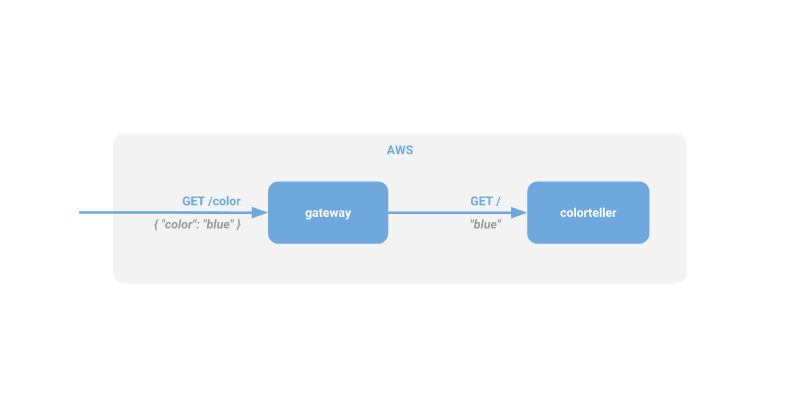

# Using AWS App Mesh with Fargate

## Overview

In the previous [article], I gave a walkthrough on how to deploy the Color App to ECS and configure [AWS App Mesh] to provide traffic management and observability. In this article, we are going to start to explore what it means when we say that App Mesh is a service mesh that lets you control and monitor services spanning different AWS compute environments. We'll start with using Fargate as an ECS launch type to deploy a specific version of our `colorteller` service before we move on and explore distributing traffic across other environments, such as EC2 and EKS.

This is deliberately intended to be a simple example, but in the real world there are many use cases where creating a service mesh that can bridge different compute environments becomes very useful. This contrived example demonstrates a scenario in which you already have a containerized application running on ECS, but want to shift your workloads to use [Fargate] so that you don't have to manage infrastructure directly. Fargate helps you containerized tasks using the same ECS primitives as the rest of your application without the need to directly configure EC2 instances.

Our strategy will be to deploy a new version of our `colorteller` service with Fargate and begin shifting traffic to it. If all goes well, then we will shift 100% of our traffic to the new version. For this demo, we'll use "blue" to represent the original version and "red" to represent the new version.

As a refresher, this is what the programming model for the Color App looks like:

<b><i>Figure 1.</i></b> Programmer perspective of the Color App.

In terms of App Mesh configuration, we will want to begin shifting traffic over from version 1 (represented by `colorteller-blue`) over to version 2 (represented by `colorteller-red`). Remember, in App Mesh, every version of a service is backed by actual running code somewhere (in this case ECS/Fargate tasks), so each service will have it's own *virtual node* represenation in the mesh:

<b><i>Figure 2.</i></b> App Mesh configuration of the Color App.

Finally, there is the physical deployment of the application itself to a compute environment. In this demo, `colorteller-blue` runs on ECS using the EC2 launch type and `colorteller-red` will run on ECS using the Fargate launch type. Our goal is to test with a portion of traffic going to `colorteller-blue`, ultimately increasing to 100% of traffic going to this version.

<b><i>Figure 3.</i></b> AWS deployment perspective of the Color App.

[A/B testing]: https://en.wikipedia.org/wiki/A/B_testing
[article]: ./walkthrough.md
[AWS App Mesh]: https://aws.amazon.com/app-mesh/
[Fargate]: https://aws.amazon.com/fargate/