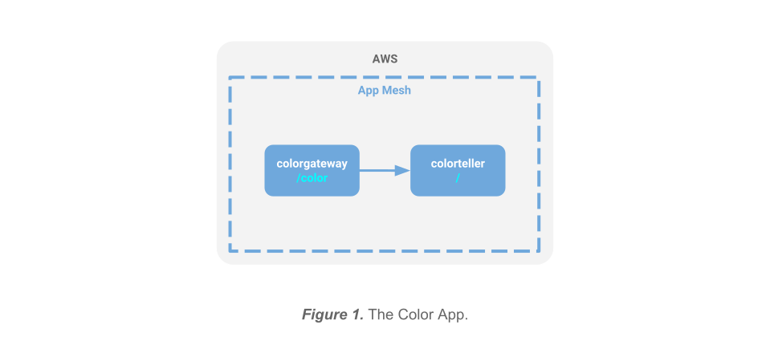

# Walkthrough: Deploy the Color App on ECS

This is a walkthrough for deploying the [Color App] that was demonstrated at the AWS App Mesh launch.



- [Walkthrough: Deploy the Color App on ECS](#walkthrough-deploy-the-color-app-on-ecs)
  - [Overview](#overview)
  - [Prerequisites](#prerequisites)
  - [Deploy infrastructure for the application](#deploy-infrastructure-for-the-application)
    - [Create the VPC and other core Infrastructure](#create-the-vpc-and-other-core-infrastructure)
    - [Create an App Mesh](#create-an-app-mesh)
    - [Create compute resources](#create-compute-resources)
    - [Review](#review)
  - [Deploy the application](#deploy-the-application)
    - [Configure App Mesh resources](#configure-app-mesh-resources)
    - [Deploy services to ECS](#deploy-services-to-ecs)
  - [Shape traffic](#shape-traffic)
    - [Apply traffic rules](#apply-traffic-rules)
    - [Monitor with Amazon CloudWatch and AWS X-Ray](#monitor-with-amazon-cloudwatch-and-aws-x-ray)
  - [Summary](#summary)
  - [Resources](#resources)

## Overview

This brief guide will walk you through deploying the Color App on ECS. The process has been automated using shell scripts and [AWS CloudFormation] templates to make deployment straightforward and repeatable.

Core networking and compute infrastructure doesn't need to be recreated each time the Color App is redeployed. Since this is the most time-consuming aspect of a full deployment, resource provisioning is divided among a layered set of CloudFormation stack templates.

The App Mesh deployment is also partitioned into different stages as well, but this for for performance reasons since App Mesh operations are very fast. The reason for the separation is simply so you can tear down the Color App without tearing down the demo mesh in case you also have other sample apps running in it for experimentation.

**Infrastructure templates:**

* `examples/infrastructure/vpc.yaml` - creates the VPC and other core networking resources needed for the application independent of the specific compute environment (e.g., ECS) provisioned for cluster.
* `examples/infrastructure/ecs-cluster.yaml` - creates the compute instances and other resources needed for the cluster.
* `examples/infrastructure/appmesh-mesh.yaml` - creates an App Mesh mesh.

**Application resource templates:**

* `examples/apps/colorapp/ecs/ecs-colorapp.yaml` - deploys application services and related resources for the Color App.
* `examples/apps/colorapp/ecs/servicemesh/appmesh-colorapp.yaml` - creates mesh resources for the Color App.

Each template has a corresponding shell script with a `.sh` extension that you run to create the CloudFormation stack. These scripts rely on the following environment variables values that must be exported before running:

* `AWS_PROFILE` - your AWS CLI profile (set to `default` or a named profile).
* `AWS_DEFAULT_REGION` - set to one of the [Currently available AWS regions for App Mesh].
* `ENVIRONMENT_NAME` - will be applied as a prefix to deployed CloudFormation stack names.
* `MESH_NAME` - name to use to identify the mesh you create.
* `SERVICES_DOMAIN` - the base namespace to use for service discovery (e.g., `cluster.local`).
* `KEY_PAIR_NAME` - your [Amazon EC2 Key Pair].
* `CLUSTER_SIZE` - (optional) the number of EC2 instances to provision for the ECS cluster (default = 5).
* `ENVOY_IMAGE` - see [Envoy Image] for recommended Docker image (currently: `111345817488.dkr.ecr.us-west-2.amazonaws.com/aws-appmesh-envoy:v1.9.0.0-prod`)
* `COLOR_GATEWAY_IMAGE` - Docker image for the Color App `colorgateway` microservice (`subfuzion/colorgatway`).
* `COLOR_TELLER_IMAGE` - Docker image for the Color App `colorteller` microservice (`subfuzion/colorteller`).

See below for more detail and to see where these environment variables are used.

## Prerequisites

1. You have version `1.16.124` or higher of the [AWS CLI] installed.

2. Your [AWS CLI configuration] has a `default` or named profile and valid credentials.

3. You have an [Amazon EC2 Key Pair] that you can use to log into your EC2 instances.

4. You have cloned the [github.com/aws/aws-app-mesh-examples] repo and changed directory to the project root.

## Deploy infrastructure for the application

### Create the VPC and other core Infrastructure

An [Amazon Virtual Private Cloud] (VPC) is a virtual network that provides isolation from other applications in other networks running on AWS. The following CloudFormation template will be used to create a VPC for our mesh sample applications:

`examples/infrastructure/vpc.yaml`

Set the following environment variables:

* `AWS_PROFILE` - your AWS CLI profile (set to `default` or a named profile)
* `AWS_DEFAULT_REGION` - set to one of the [Currently available AWS regions for App Mesh]
* `ENVIRONMENT_NAME` - will be applied as a prefix to deployed CloudFormation stack names

Run the `vpc.sh` script to create a VPC for the application in the region you specify. It will be configured for two availability zones (AZs); each AZ will be configured with a public and a private subnet. You can choose to from one of the nineteen [Currently available AWS regions for App Mesh]. The deployment will include an [Internet Gateway] and a pair of [NAT Gateways] (one in each AZ) with default routes for them in the private subnets.

***Create the VPC***

`examples/infrastructure/vpc.sh`

```
$ export AWS_PROFILE=default
$ export AWS_DEFAULT_REGION=us-west-2
$ export ENVIRONMENT_NAME=DEMO
$ ./examples/infrastructure/vpc.sh
...
+ aws --profile default --region us-west-2 cloudformation deploy --stack-name DEMO-vpc --capabilities CAPABILITY_IAM --template-file examples/infrastructure/vpc.yaml --parameter-overrides EnvironmentName=DEMO 
Waiting for changeset to be created..
Waiting for stack create/update to complete
...
Successfully created/updated stack - DEMO-vpc
$
```

### Create an App Mesh

[AWS App Mesh] is a service mesh (a logical boundary for network traffic between services that reside in it) that provides application-level networking support, standardizing how you control and monitor your services across multiple types of compute infrastructure. The following CloudFormation template will be used to create an App Mesh mesh for our application:

`examples/infrastructure/appmesh-mesh.yaml`

We will use the same environment variables from the previous step, plus one additional one (`MESH_NAME`), to deploy the stack.

* `MESH_NAME` - name to use to identify the mesh you create (we'll use `appmesh-mesh`)

***Create the mesh***

`examples/infrastructure/appmesh-mesh.sh`

```
$ export AWS_PROFILE=default
$ export AWS_DEFAULT_REGION=us-west-2
$ export ENVIRONMENT_NAME=DEMO
$ export MESH_NAME=appmesh-mesh
$ ./examples/infrastructure/appmesh-mesh.sh
...
+ aws --profile default --region us-west-2 cloudformation deploy --stack-name DEMO-appmesh-mesh --capabilities CAPABILITY_IAM --template-file /home/ec2-user/projects/aws/aws-app-mesh-examples/examples/infrastructure/appmesh-mesh.yaml --parameter-overrides EnvironmentName=DEMO AppMeshMeshName=appmesh-mesh

Waiting for changeset to be created..
Waiting for stack create/update to complete
...
Successfully created/updated stack - DEMO-appmesh-mesh
$
```

At this point we have now created our networking resources (VPC and App Mesh), but we have not yet deployed:

* compute resources to run our services on
* mesh configuration for our services
* actual services

### Create compute resources

Our infrastructure requires compute resources to run our services on. The following CloudFormation template will be used to create these resources for our application:

`examples/infrastructure/ecs-cluster.yaml`

In addition to the previous defined environment variables, you will also need to export the following:

* `SERVICES_DOMAIN` - the base namespace to use for service discovery (e.g., `cluster.local`). For this demo, we will use `demo.local`. This means that the colorgateway virtual service will send requests to the colorteller virtual service at `colorteller.demo.local`.
* `KEY_PAIR_NAME` - your [Amazon EC2 Key Pair] to log into your EC2 instances.

You can also override the demo script's default cluster size (5) by setting `CLUSTER_SIZE`:

* `CLUSTER_SIZE` - (optional) the number of EC2 instances to provision for the ECS cluster (default = 5).

***Create the ECS cluster***

`examples/infrastructure/ecs-cluster.sh`

```
$ export AWS_PROFILE=default
$ export AWS_DEFAULT_REGION=us-west-2
$ export ENVIRONMENT_NAME=DEMO
$ export SERVICES_DOMAIN=demo.local
$ export KEY_PAIR_NAME=tony_devbox2
$ ./examples/infrastructure/ecs-cluster.sh
...
+ aws --profile default --region us-west-2 cloudformation deploy --stack-name DEMO-ecs-cluster --capabilities CAPABILITY_IAM --template-file /home/ec2-user/projects/aws/aws-app-mesh-examples/examples/infrastructure/ecs-cluster.yaml --parameter-overrides EnvironmentName=DEMO KeyName=tony_devbox2 ECSServicesDomain=demo.local ClusterSize=5

Waiting for changeset to be created..
Waiting for stack create/update to complete
...
Successfully created/updated stack - DEMO-ecs-cluster
$
```

### Review

You have provisioned the infrastructure you need. You can confirm in the AWS Console that all of your CloudFormation stacks have been successfully deployed. You should see something like this:


## Deploy the application

### Configure App Mesh resources

### Deploy services to ECS

## Shape traffic

### Apply traffic rules

### Monitor with Amazon CloudWatch and AWS X-Ray

## Summary

## Resources

[AWS App Mesh Documentation]

[AWS CLI]

[Color App]

[Currently available AWS regions for App Mesh]

[Envoy Image]

[Envoy documentation]


[A/B testing]: https://en.wikipedia.org/wiki/A/B_testing
[Amazon CloudWatch]: https://aws.amazon.com/cloudwatch/
[Amazon EC2 Key Pair]: https://docs.aws.amazon.com/AWSEC2/latest/UserGuide/ec2-key-pairs.html
[Amazon Virtual Private Cloud]: https://docs.aws.amazon.com/vpc/latest/userguide/what-is-amazon-vpc.html
[AWS App Mesh]: https://aws.amazon.com/app-mesh/
[AWS App Mesh Documentation]: https://aws.amazon.com/app-mesh/getting-started/
[AWS CLI]: https://docs.aws.amazon.com/cli/latest/userguide/cli-chap-install.html
[AWS CLI configuration]: https://docs.aws.amazon.com/cli/latest/userguide/cli-chap-configure.html
[AWS CloudFormation]: https://aws.amazon.com/cloudformation/
[AWS X-Ray]: https://aws.amazon.com/xray/
[Blue-Green deployments]: https://martinfowler.com/bliki/BlueGreenDeployment.html
[Canary releases]: https://martinfowler.com/bliki/CanaryRelease.html
[Color App]: https://github.com/aws/aws-app-mesh-examples/tree/master/examples/apps/colorapp
[Currently available AWS regions for App Mesh]: ./regions.md
[Elastic Load Balancing]: https://docs.aws.amazon.com/elasticloadbalancing/latest/userguide/what-is-load-balancing.html
[Envoy]: https://www.envoyproxy.io/ 
[Envoy documentation]: https://www.envoyproxy.io/docs/envoy/latest/
[Envoy Image]: https://docs.aws.amazon.com/app-mesh/latest/userguide/envoy.html
[github.com/aws/aws-app-mesh-examples]: https://github.com/aws/aws-app-mesh-examples
[Internet Gateway]: https://docs.aws.amazon.com/vpc/latest/userguide/VPC_Internet_Gateway.html
[NAT Gateways]: https://docs.aws.amazon.com/vpc/latest/userguide/vpc-nat-gateway.html
